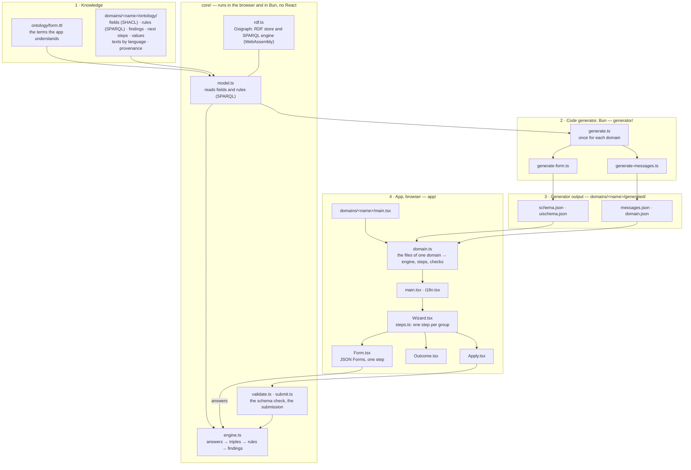

# eligibility

A browser-only proof of concept, built like [`imci-fever`](../imci-fever/) and made generic: a
step-by-step wizard for an application under a law or an ordinance. A knowledge model describes
one process (a *domain*): its questions, its rules, what follows, and the articles that each part
comes from. The app knows none of it: it reads the fields, the rules and the texts from the model,
and runs the rules (SPARQL) in the browser. It is a demonstration of the approach, not an
application for real use.

| Domain | Process | Page |
| --- | --- | --- |
| [`wef`](domains/wef/) | Pension money for a home (BVG Art. 30a–30g, WEFV) | `/eligibility/wef/` |

> **Demonstration only. Not legal or financial advice.** See each domain for what was checked.

## How it works

The same four parts as `imci-fever`, once for the app and once for each domain. One difference: the
rules are not compiled. The model holds them as SPARQL queries, and the engine runs them as they
are. The generator only makes the files that JSON Forms needs.



| Folder | Part | What it holds |
| --- | --- | --- |
| `ontology/` | Knowledge | `form.ttl`: the few terms that the app understands, and the texts of the app itself, for every domain |
| `domains/<name>/` | One domain | Everything about one domain: `ontology/` (its model, the source of truth), `generated/`, `domain.ts`, `main.tsx`, `index.html`, `test/`, `README.md` |
| `generator/` | Code generator | `bun run generate` writes, for each domain, the JSON Forms schema and UI schema from the SHACL shape, the texts by language, and the region. Do not edit the output; a test fails if it is older than the model |
| `core/` | Model and rules | Runs in the browser and in Bun (the generator, the tests, or a server), without React. `rdf.ts` loads Oxigraph; `model.ts` reads the fields and the rules of a model; `engine.ts` runs the rules; `validate.ts` checks the answers against the schema; `submit.ts` decides on a submitted application |
| `app/` | App | React. `domain.ts` makes the engine, the steps and the checks of one domain. `Wizard.tsx`, `steps.ts` and `Form.tsx` are the wizard; `Outcome.tsx` the result; `i18n.tsx` the languages; `Apply.tsx` submits the application |

Each test is next to the code it tests, on a small model of its own; the tests of a domain are in
its `test/` folder. `test-setup.ts` loads Oxigraph before the tests.

No file in `app/`, `core/` or `generator/` knows a domain. The languages of a domain are those of
its title (the `rdfs:label` of its shape); its texts, and the texts of the app in `form.ttl`, must
exist in each of them.

## Adding a domain

1. Write the model in `domains/<name>/ontology/`: one `sh:NodeShape` with a title in each language
   and a `form:region`, its groups and fields, its rules, values, findings and next steps, and their
   sources. A new language also needs the texts of the app in `ontology/form.ttl`; the generator
   names the missing ones.
2. Copy `domain.ts`, `main.tsx` and `index.html` from an existing domain, and change the names.
3. `bun run generate`, then write the domain's tests in `domains/<name>/test/`.

`bun run dev` and `bun run build` find the new domain by its folder. It gets its own page,
`/<name>/` in development and `/eligibility/<name>/` on the site; there is no page that lists the
domains. In this folder, only one shared file changes: the domain table at the top of this README.
The landing page of the site (`../site/index.html`) needs a link to it.

### The form vocabulary

`form.ttl` defines what a domain model can tell the app, in addition to SHACL, SHACL Advanced
Features and PROV-O:

| Term | Meaning |
| --- | --- |
| `form:today` | The date of the evaluation. The engine adds it to `$this`; the person does not enter it |
| `form:region` | On the shape: the region whose way of writing dates and numbers the app uses, for example `CH` |
| `form:askedWhen` | On a field: a SPARQL ASK query. The field is asked only when it is true |
| `form:finding`, `form:Finding`, `form:severity` | What the rules found: `form:Refusal` and `form:NotYet` block the application, `form:Notice` does not |
| `form:nextStep`, `form:NextStep` | What follows when the application is allowed |
| `form:Value` | A derived property of `$this` that the app shows, for example the maximum amount |
| `form:yes`, `form:no` | The answers to yes/no questions |
| `form:Text` | A text of the app itself (buttons, headings, messages), in each language |

### The engine

`core/engine.ts` (about 100 lines) does four things:

1. The answers become triples about one focus node, `$this`, of the shape's `sh:targetClass`, with
   `form:today`. A choice becomes the IRI of the choice; a date an `xsd:date`.
2. The rules of the shape (`sh:rule`, each a `sh:SPARQLRule` with a CONSTRUCT query) run in their
   `sh:order`, again and again, until no rule adds a new triple. `$this` is bound with a `VALUES`
   clause at the end of each query, as SHACL pre-binds it. The prefixes come from `sh:prefixes` and
   `sh:declare`, as in SHACL.
3. A field with `form:askedWhen` is asked when its ASK query is true. The answer to a field that is
   not asked does not count: the engine removes it and runs the rules again.
4. It reads back what the rules derived: the values, the findings and the next steps, with their
   sources. The application is allowed when every asked field with `sh:minCount 1` has an answer
   and no finding blocks it.

## The wizard

The steps are the categories of the generated UI schema, one for each `sh:PropertyGroup` of the
model, in their `sh:order`. A step is complete when each question that the engine asks has an
answer, and no answer has an error. Next on an incomplete step marks the open questions. The last
step, "Review and submit", lists the answers with a link back to each step, then the findings, the
next steps and the values. When nothing blocks the application, the person submits it.

## The submission

"Submit the application" calls `submit()` in `core/submit.ts`. It shows what a server would do with
the application: check the answers against the domain's schema and decide again with the same
engine and model. It replies with a refusal (`invalid` with the wrong fields, `incomplete` with the
missing fields, `refused` with the findings that block) or a receipt (a reference, the date, the
values, the findings and the next steps). The replies hold ids of the model, so the page shows them
in its language. Nothing is sent and nothing is stored. In the browser this check protects nothing;
the engine and the models also run in Bun (the tests do), so they can move to a server as they are.

## Commands

```
bun install
bun run dev        # generate, then serve each domain at http://127.0.0.1:3518/<name>/
bun run test       # run the tests (they fail if a generated file is old)
bun run build      # generate, then write one static site per domain to dist/<name>/
bun run typecheck
```

Each `dist/<name>/` contains only static files with relative paths, so any static host can serve it
from any path, for example GitHub Pages at `/eligibility/wef/`.

## Licence

Swiss laws and ordinances are not protected by copyright (URG Art. 5), so this folder, the
knowledge models included, is MIT licensed, like the code of the repository.
