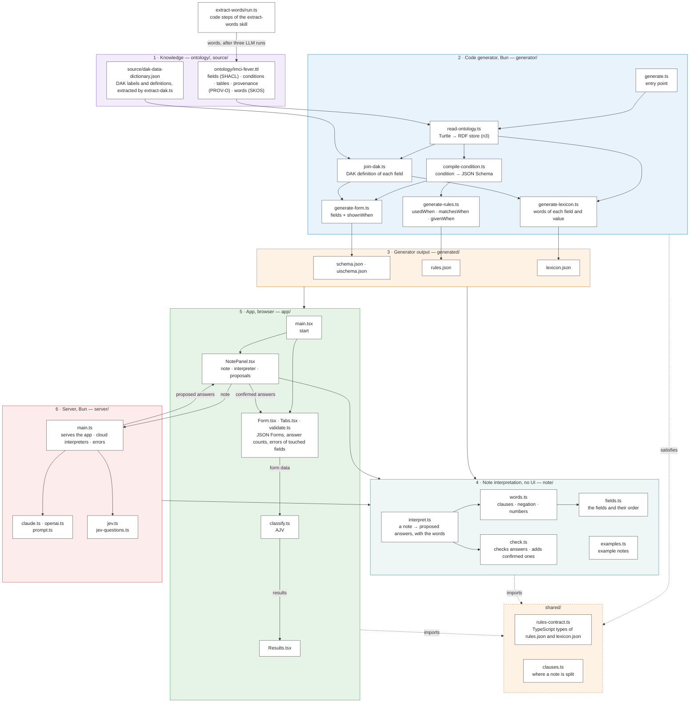
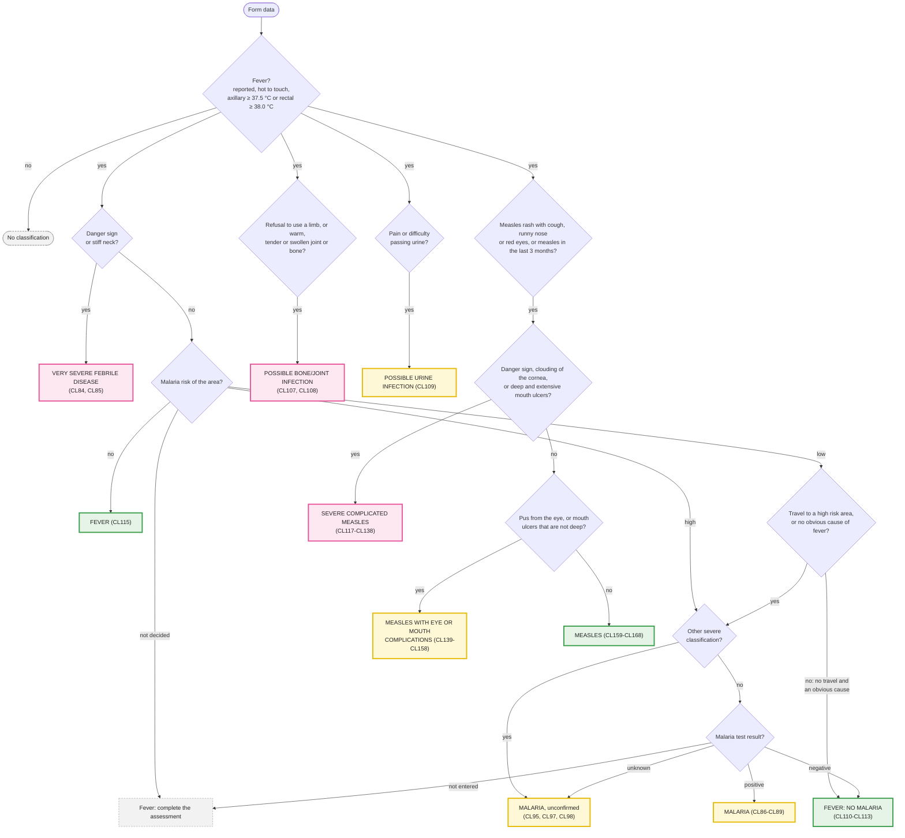

# imci-fever

A proof of concept. A knowledge model describes the fever part of IMCI for children aged 2 months
up to 5 years. A code generator changes the model into the input files of
[JSON Forms](https://jsonforms.io). The app shows the form and classifies the child while you type.
Instead of filling the form, the user can describe the child in a note: an interpreter turns it into
proposed answers. The form, the classification and the words interpreter run in the browser; the
cloud interpreters need the local server and their API keys.

The knowledge model is adapted from the
[WHO Digital adaptation kit for child health (0–59 months) in humanitarian emergencies](https://www.who.int/publications/i/item/9789240089907)
(2024): the fields from its core data dictionary (Web Annex A), the logic from its decision-support
tables (Web Annex B). Each field, row, qualifier and treatment names its DAK entries with
`prov:wasDerivedFrom`, and the app shows them under each result.

> **Demonstration only. Not a medical device.** Not reviewed by a clinician. The model is licensed
> CC BY-NC-SA 3.0 IGO, like the DAK. This adaptation was not created by WHO, and WHO is not
> responsible for its content or accuracy.

## How it works

The project has 6 parts. Each part is a folder, and each node in the drawing is a file or a small
group of files. Arrows show what uses what, between files or between whole parts, and their labels
name the data that goes along them. Dotted arrows show which parts use the types of the contract.
At the top, `extract-words/run.ts` adds words to the knowledge model after three LLM runs of the
extract-words skill (see "The words of the knowledge model").



The note interpretation in `note/` has no UI, so the browser and the server use the same code:
the note panel interprets with the words in the browser, and the server starts Jev from the words
interpretation and removes, for every interpreter, the answers that the form would not ask. It uses
one function of the app, `visibleOnly()` in `classify.ts`, so that "shown" means the same everywhere.

| Folder | Part | What it holds |
| --- | --- | --- |
| `ontology/` | Knowledge | `imci-fever.ttl`, the source of truth: the fields, the conditions, the classification tables and their sources |
| `source/` | Knowledge | `dak-data-dictionary.json`: the data elements of the DAK data dictionary (ID, label, definition, input options), extracted from the published spreadsheet by `generator/extract-dak.ts`. Do not edit |
| `generator/` | Code generator | Bun scripts that change the ontology into the files in `generated/`. `bun run generate` runs them. `join-dak.ts` joins each field to its DAK data element |
| `generated/` | Generator output | `schema.json`, `uischema.json`, `rules.json` and `lexicon.json`. Do not edit them. Git tracks them, so a review shows how a change to the ontology changes the app |
| `shared/` | Shared by the generator and the apps | `rules-contract.ts`, the TypeScript types of `rules.json` and `lexicon.json`; `clauses.ts`, where a note is split into clauses (the words interpreter splits there, and the generator rejects words that contain a split point) |
| `note/` | Note interpretation | Turns a note into proposed form answers with the words of the ontology, checks proposed answers, and holds the example notes. No UI: the app, the server and the evaluations use it |
| `app/` | App | The React app that runs in the browser: `main.tsx`, `Form.tsx` and `Tabs.tsx` (the form, with an answer count on each tab), `validate.ts` (errors only for fields the user touched), `classify.ts`, `Results.tsx` and `NotePanel.tsx` |
| `server/` | Server | `bun run dev`: serves the app on 127.0.0.1 and runs the cloud interpreters with their API keys |
| `extract-words/` | Words | `run.ts`, the code steps of the extract-words skill (`.claude/skills/extract-words`), and `runs/`: one folder per run with its input, prompt, the three LLM replies and the result of every proposed word |
| `eval/` | Evaluations | The development and held-out notes, the scoring, and one script for each cloud interpreter (see Evaluations). Not part of the app |
| `test/` | Tests | `chart-paths.test.ts` has one test for each path of the classification logic. `chart-invariants.test.ts` checks rules that must be true for all form data, on 3,000 generated combinations. `interpret.test.ts` tests interpreting a note with the words, `check.test.ts` the checks and the prompt, `score.test.ts` the evaluation's scoring |

The unit tests of the generator are next to the files that they test, for example
`generator/compile-condition.test.ts`. The tests in `test/` check the medical content: the real
ontology, the generator and the classifier together. Their names cite the DAK rows they check,
for example `CL84`. If a row of the DAK changes, update them.

After a change to the ontology, run `bun run generate` and commit the changed files in
`generated/` together with the ontology. A test fails if the files in `generated/` are old.

The generator stops with an error when a condition uses a field that the form does not have,
or when a named condition is not an `imci:Condition`. Such errors would otherwise be silent.

### Terms

- A **field** is one question in the form, for example `axillaryTemperature`. SHACL calls it a property,
  and JSON Forms shows it with a control.
- A **condition** is a yes/no question about the form data, for example "temperature ≥ 38.5 °C".
  `generator/compile-condition.ts` changes each condition into a JSON Schema. The form data
  matches the condition when it is valid against that schema.
- A **rule** is a condition and its effect. The ontology has 4 kinds of rules:

  | Ontology term | Effect when the condition is true | Applied by |
  | --- | --- | --- |
  | `imci:shownWhen` | a field or a tab is shown | JSON Forms (a `SHOW` rule) and `classify.ts` |
  | `imci:usedWhen` | a classification table is used | `classify.ts` |
  | `imci:matchesWhen` | a row matches. In the ontology, as in the chart, the first row that matches is the classification | `classify.ts` |
  | `imci:givenWhen` | a qualifier or a treatment applies | `classify.ts` |

  In `rules.json`, the generator adds "and no row above it matches" to each row condition. The rows
  then exclude each other, so a program that reads `rules.json` does not need to know about the order.

- A **qualifier** adds detail to a classification, for example "Malaria unconfirmed". A row lists
  its qualifiers with `imci:qualifiers`.
- **Provenance:** `prov:wasDerivedFrom` names the DAK entries that a field, row, qualifier or
  treatment comes from, for example `CHE.DT.01.CL84`. Part 5 of the ontology lists them.

  `classify.ts` also applies the `imci:shownWhen` rules: it removes the values of hidden fields
  before it classifies, so an old value in a hidden field does not change the result.

### From SHACL to JSON Forms

| Ontology | JSON Forms |
| --- | --- |
| `sh:property` with `sh:datatype` or `sh:in` | a property with `type` or `enum` |
| `sh:name`, `sh:description`, `sh:minInclusive`, `sh:maxInclusive` | `title`, `description`, `minimum`, `maximum` |
| `sh:PropertyGroup`, `sh:order` | a `Category` (tab), and the order of the controls |
| `imci:shownWhen` | a `SHOW` rule |

## A note in free text

Next to the form, the user can describe the child in a note, as they would write it for a
colleague, for example "Fever for 3 days, axillary temperature 38.9, no convulsions, drinks well".
Four example notes can be clicked to try it. An **interpreter** turns the note into proposed answers
for the form, each with where it comes from; the user confirms them, and they fill the same form.
The classification still comes only from `classify()` and the rules.

There are four interpreters:

| Interpreter | Kind | How it interprets the note | Evidence | API key |
| --- | --- | --- | --- | --- |
| Words of the knowledge model | no AI | In the browser: the words of part 6 of the ontology | a quote | none |
| Jev (TypeSafe) | a System 1 model: fast, typed decisions | Completes the words: one typed question for each field that the words leave empty, kept at 95% confidence or more | a confidence | `TYPESAFE_API_KEY` |
| Claude Haiku 4.5 (Anthropic) | a small frontier model | The whole note with every field | a quote | `ANTHROPIC_API_KEY` |
| gpt-6-luna (OpenAI) | a small frontier model | The same as Claude Haiku 4.5 | a quote | `OPENAI_API_KEY` |

`note/interpreters.ts` describes them once, for the app and the server.

The cloud interpreters run through the app's server (`server/main.ts`), which `bun run dev` starts
on this computer only (http://127.0.0.1:3517). The API keys stay in the server and never reach the
browser; the note is sent to the chosen provider. The app always lists all four. A cloud interpreter
that cannot run is shown greyed out, with the reason: no server, or a missing key. Errors say what went wrong: a rejected key, no
credit left, too many requests, or a provider that cannot be reached. The static build (`bun run
build`, and the published site) has no server, so only the words can be chosen there.

### The words of the knowledge model

The words link the language of a note to the questions of the form. Code makes what can be made
deterministically; the rest needs judgement and goes through a repeatable procedure:

| Part | Made by | Where |
| --- | --- | --- |
| Labels, definitions and input options of the DAK data elements | Code: `bun run extract-dak <xlsx>` | `source/dak-data-dictionary.json` |
| Each question's own label as a word ("vomiting everything") | Code: the generator | `generated/lexicon.json` |
| Each question's DAK definition, joined through `prov:wasDerivedFrom` | Code: `generator/join-dak.ts` | the form (shown when a question has the focus) and `generated/lexicon.json` |
| Synonyms, words for absence ("drinks well"), words for values, abbreviations | Three LLM runs with the extract-words skill (`.claude/skills/extract-words`), then code: consensus, checks and a regression gate | part 6 of the ontology: `skos:altLabel`, `imci:absentLabel`, `imci:valueLabel`; the record in `extract-words/runs/` |

Only the three runs need an LLM; `extract-words/run.ts` does the rest. `input` writes what the
runs get: each question's title, DAK definition, allowed values and current words, and the run
prompt. `apply` keeps
the words that at least two runs propose, drops those that name an unknown question or value,
repeat a word, contain a comma, "and" or "but" (a note is split there, so they never match) or
would state a sign both present and absent, and adds a question's words only if the development
notes do not get worse (`bun eval/words-eval.ts`, free, no API): no fewer facts found, no more wrong
answers, no danger sign invented or wrongly denied. The words are then accepted automatically; like
the rest of the model they await the clinical review. The test notes are never used.

The words find what the knowledge model names, and no more: a paraphrase ("floppy and hard to
wake"), or a negation spread over "and" ("not awake and alert"), gives no answer. That is the job of
the AI interpreters; the words stay a simple, deterministic baseline. Single generic words are
avoided for the same reason: "alert" or "short" alone would answer a danger sign "no" in sentences
that do not say so.

`test/provenance.test.ts` checks the joins: every data element that a field names exists in the
DAK, and shares a word with the field's label. The DAK reuses some IDs for different elements; the
join then takes the element whose label matches the field.

| File | What it does |
| --- | --- |
| `app/NotePanel.tsx` | The note, the example notes, the choice of interpreter, the proposals with where they come from, and the buttons to add them to the form or discard them |
| `note/interpreters.ts` | The four interpreters: name, kind, provider, API key and how each works. The app lists them with or without the server |
| `note/examples.ts` | The example notes of the panel, with the answers that a correct interpretation gives |
| `note/fields.ts` | The form fields and their order, from `schema.json` and `uischema.json` |
| `note/words.ts` | General text handling: clauses, negation, durations and numbers. Which words mean which field comes from `lexicon.json` |
| `note/interpret.ts` | Interprets a note with the words: the fields that it mentions, their values (typed values for temperatures and durations, words and negations for yes/no fields, value words for choices), then removes answers that the form would not ask |
| `note/check.ts` | Checks proposed answers (an allowed value, a quote that is in the note) and adds confirmed answers to the form data |
| `server/main.ts` | The app's server: the page, the cloud interpreters, their keys and their error messages |
| `server/claude.ts`, `server/openai.ts` | Interpret a note with Claude or OpenAI: the prompt and JSON Schema (`server/prompt.ts`, from the generated files) and the checks of `check.ts` |
| `server/jev.ts`, `server/jev-questions.ts` | Interpret a note with Jev: one typed question for each field, generated from the ontology |

## Evaluations

`eval/phrases.ts` has 30 development cases (the 4 example notes of `note/examples.ts` and 26 short phrases) and
`eval/held-out.ts` 15 notes written before any tuning, each with the answers that a correct interpretation
gives. `eval/score.ts` scores every interpreter the same way: the facts that a note states, and a short
list of accepted inferences (for example, a child convulsing now has convulsions in this illness).

The evaluations of the cloud interpreters use the same code as the server (`server/`). They send the notes to a cloud API and need a key in the environment:

| Script | Interpreter | Key |
| --- | --- | --- |
| `eval/claude-eval.ts` | Claude Haiku 4.5, with the server's prompt and checks (`server/claude.ts`); `count` estimates the cost first | `ANTHROPIC_API_KEY` |
| `eval/openai-eval.ts` | gpt-6-luna, with the server's prompt and checks (`server/openai.ts`) | `OPENAI_API_KEY` |
| `eval/jev-eval.ts` | TypeSafe Jev, a System 1 model, answering one typed question per field (`server/jev-questions.ts`), with the words, at several confidence thresholds: the threshold of the app (95%) was chosen on the development notes | `TYPESAFE_API_KEY` |

Each saves its replies in `eval/results/` (not in Git). Two more scripts need no key and call no
API: `bun eval/words-eval.ts` scores the words of the knowledge model, and `bun eval/rescore.ts`
re-scores the saved replies, with the words as they are now.

## Classification logic

There are four tables: fever, bone or joint, urine, and measles. One child can get a result from
each. In each table, the first row that matches is the result. The DAK row IDs are in brackets.



The qualifiers "high parasite density" and "fever every day for more than 7 days" add a referral
to the hospital for assessment. Pink marks a DAK severe classification; yellow and green follow the
IMCI colour convention, which the DAK does not name.

## Run it on your computer

The published demo runs in the browser only, so it offers the words of the knowledge model. The
cloud interpreters need the app's server on your computer and an API key from each AI provider
whose interpreter you want to use.

1. Install [Bun](https://bun.sh) and Git.
2. Get the code of this version and install its dependencies:

   ```
   git clone --branch part-6 https://github.com/almilo/software-that-knows.git
   cd software-that-knows/imci-fever
   bun install
   ```

3. Set the API keys of the interpreters you want, in the shell that starts the app. Each key comes
   from the provider's console; an interpreter without its key is shown but cannot be chosen.

   | Interpreter | Provider | Environment variable |
   | --- | --- | --- |
   | Jev | TypeSafe | `TYPESAFE_API_KEY` |
   | Claude Haiku 4.5 | Anthropic | `ANTHROPIC_API_KEY` |
   | gpt-6-luna | OpenAI | `OPENAI_API_KEY` |

   For example: `export OPENAI_API_KEY=...`. Each interpretation is billed to your account by the
   provider, and the note is sent to that provider.
4. Start the app with `bun run dev` and open http://127.0.0.1:3517. It listens on this computer only.

## Commands

```
bun install
bun run dev        # generate, then serve on 127.0.0.1:3517 with the cloud interpreters (their API keys in the environment)
bun run test       # run the tests (they fail if generated/ is old)
bun run build      # generate, then write static files to dist/
bun run typecheck
bun run extract-dak "<path>/WHO DAK child health - core data dictionary.xlsx"   # refresh source/ from the DAK
bun eval/words-eval.ts   # the words interpreter on the evaluation notes (free, no API)
bun extract-words/run.ts input|apply <folder>   # the code steps of the extract-words skill
```

The `dist/` directory contains only static files with relative paths. Any static host can
serve it, for example GitHub Pages. Without the server, the app offers the words interpreter only.
