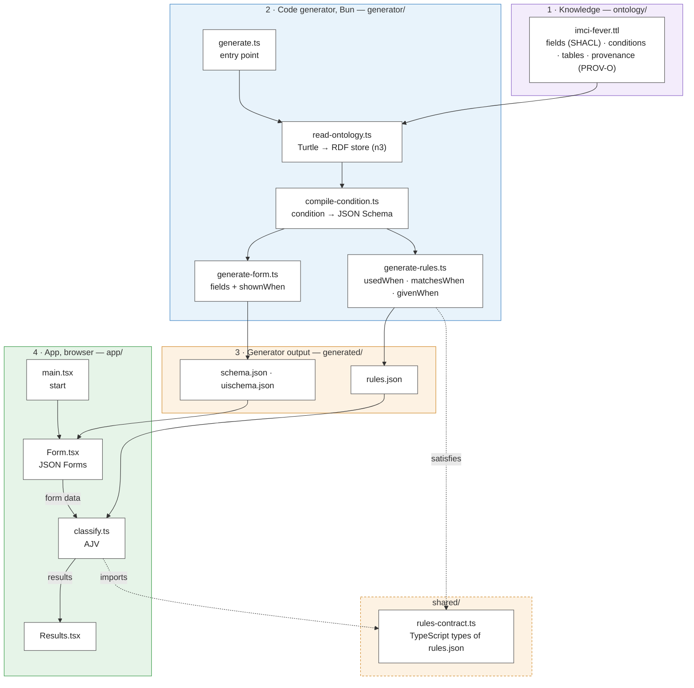

# imci-fever

A browser-only proof of concept. A knowledge model describes the fever part of IMCI for children
aged 2 months up to 5 years. A code generator changes the model into the input files of
[JSON Forms](https://jsonforms.io). The app shows the form and classifies the child while you type.

The knowledge model is adapted from the
[WHO Digital adaptation kit for child health (0–59 months) in humanitarian emergencies](https://www.who.int/publications/i/item/9789240089907)
(2024): the fields from its core data dictionary (Web Annex A), the logic from its decision-support
tables (Web Annex B). Each field, row, qualifier and treatment names its DAK entries with
`prov:wasDerivedFrom`, and the app shows them under each result.

> **Demonstration only. Not a medical device.** Not reviewed by a clinician. The model is licensed
> CC BY-NC-SA 3.0 IGO, like the DAK. This adaptation was not created by WHO, and WHO is not
> responsible for its content or accuracy.

## How it works

The project has 4 parts. Each part is a folder, and each node in the drawing is a file.
Solid arrows are data. Dotted arrows show which files use the types of the contract.



| Folder | Part | What it holds |
| --- | --- | --- |
| `ontology/` | Knowledge | `imci-fever.ttl`, the source of truth: the fields, the conditions, the classification tables and their sources |
| `generator/` | Code generator | Bun scripts that change the ontology into the files in `generated/`. `bun run generate` runs them |
| `generated/` | Generator output | `schema.json`, `uischema.json` and `rules.json`. Do not edit them. Git tracks them, so a review shows how a change to the ontology changes the app |
| `shared/` | Contract | `rules-contract.ts`, the TypeScript types of `rules.json`. The generator and the app both use them |
| `app/` | App | The React app that runs in the browser: `main.tsx`, `Form.tsx`, `classify.ts`, `Results.tsx` |
| `test/` | Chart tests | `chart-paths.test.ts` has one test for each path of the classification logic. `chart-invariants.test.ts` checks rules that must be true for all form data, on 3,000 generated combinations |

The unit tests of the generator are next to the files that they test, for example
`generator/compile-condition.test.ts`. The tests in `test/` check the medical content: the real
ontology, the generator and the classifier together. Their names cite the DAK rows they check,
for example `CL84`. If a row of the DAK changes, update them.

After a change to the ontology, run `bun run generate` and commit the changed files in
`generated/` together with the ontology. A test fails if the files in `generated/` are old.

The generator stops with an error when a condition uses a field that the form does not have,
or when a named condition is not an `imci:Condition`. Such errors would otherwise be silent.

### Terms

- A **field** is one question in the form, for example `axillaryTemperature`. SHACL calls it a property,
  and JSON Forms shows it with a control.
- A **condition** is a yes/no question about the form data, for example "temperature ≥ 38.5 °C".
  `generator/compile-condition.ts` changes each condition into a JSON Schema. The form data
  matches the condition when it is valid against that schema.
- A **rule** is a condition and its effect. The ontology has 4 kinds of rules:

  | Ontology term | Effect when the condition is true | Applied by |
  | --- | --- | --- |
  | `imci:shownWhen` | a field or a tab is shown | JSON Forms (a `SHOW` rule) and `classify.ts` |
  | `imci:usedWhen` | a classification table is used | `classify.ts` |
  | `imci:matchesWhen` | a row matches. In the ontology, as in the chart, the first row that matches is the classification | `classify.ts` |
  | `imci:givenWhen` | a qualifier or a treatment applies | `classify.ts` |

  In `rules.json`, the generator adds "and no row above it matches" to each row condition. The rows
  then exclude each other, so a program that reads `rules.json` does not need to know about the order.

- A **qualifier** adds detail to a classification, for example "Malaria unconfirmed". A row lists
  its qualifiers with `imci:qualifiers`.
- **Provenance:** `prov:wasDerivedFrom` names the DAK entries that a field, row, qualifier or
  treatment comes from, for example `CHE.DT.01.CL84`. Part 5 of the ontology lists them.

  `classify.ts` also applies the `imci:shownWhen` rules: it removes the values of hidden fields
  before it classifies, so an old value in a hidden field does not change the result.

### From SHACL to JSON Forms

| Ontology | JSON Forms |
| --- | --- |
| `sh:property` with `sh:datatype` or `sh:in` | a property with `type` or `enum` |
| `sh:name`, `sh:description`, `sh:minInclusive`, `sh:maxInclusive` | `title`, `description`, `minimum`, `maximum` |
| `sh:PropertyGroup`, `sh:order` | a `Category` (tab), and the order of the controls |
| `imci:shownWhen` | a `SHOW` rule |

## Classification logic

There are four tables: fever, bone or joint, urine, and measles. One child can get a result from
each. In each table, the first row that matches is the result. The DAK row IDs are in brackets.


The qualifiers "high parasite density" and "fever every day for more than 7 days" add a referral
to the hospital for assessment. Pink marks a DAK severe classification; yellow and green follow the
IMCI colour convention, which the DAK does not name.

## Commands

```
bun install
bun run dev        # generate, then serve with hot reload
bun run test       # run the tests (they fail if generated/ is old)
bun run build      # generate, then write static files to dist/
bun run typecheck
```

The `dist/` directory contains only static files with relative paths. Any static host can
serve it, for example GitHub Pages. The app has no backend.
